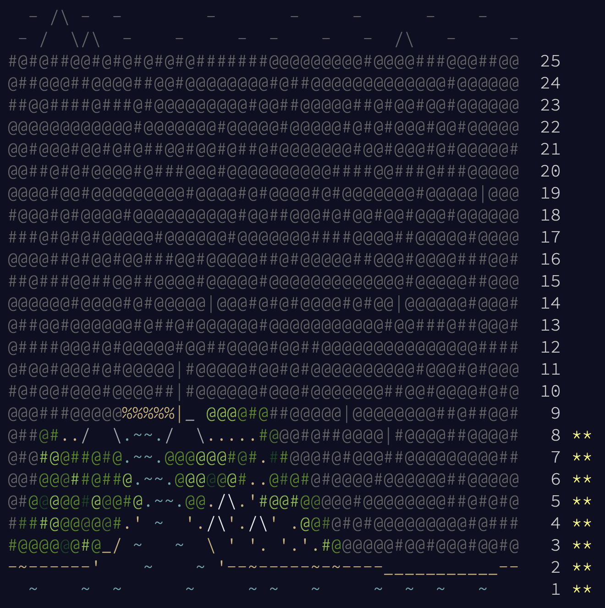

# Advent Of Code 2022

### 🌟 Days 1-5
Days 1 to 5 were made in `Python`. You can use your favorite Python interpreter to run it:
```shell
cd Day1
python3 day1.py
```

### 🌟 Days 6-10
Days 6 to 10 were made in `C#`. You can compile and run the code with the _.NET SDK_:
```shell
cd Day5
dotnet run
```

### Progress Capture

<details>
  <summary>Advent Of Code 2022</summary>
  
  
  
</details>

#### System Information

_Code should work with older versions and OS._

| Program | Version |
| ---------------- | --- |
| macOS | 13.3.1 (22E261) |
| Python | 3.10.0 |
| .NET | 7.0.203 (Arm64) |
